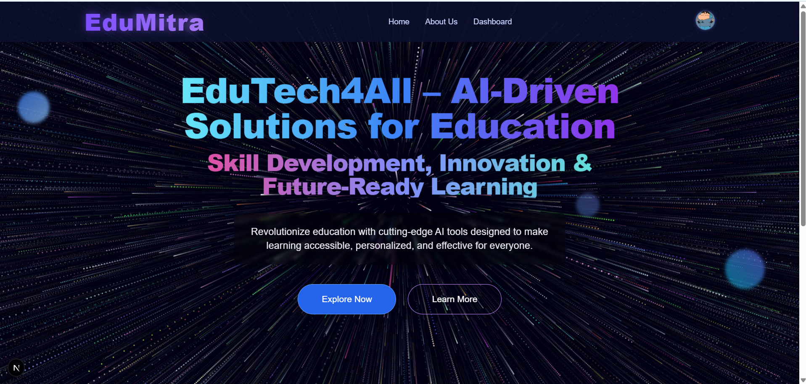
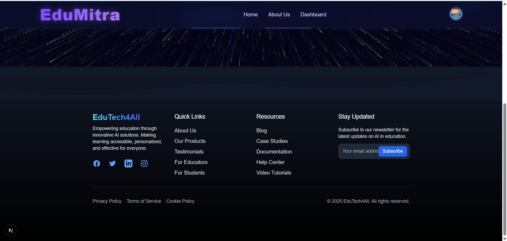
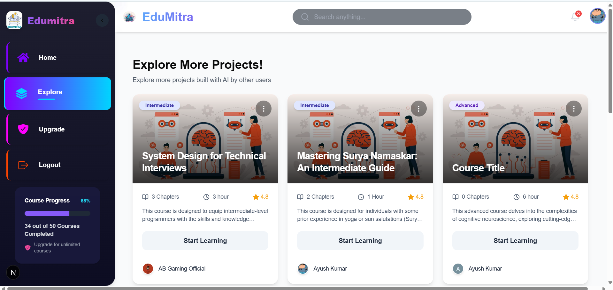
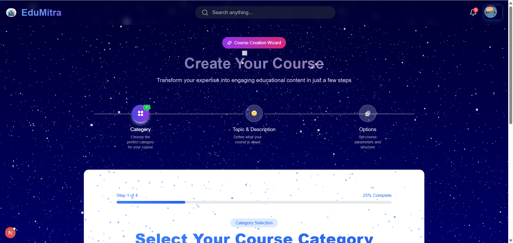
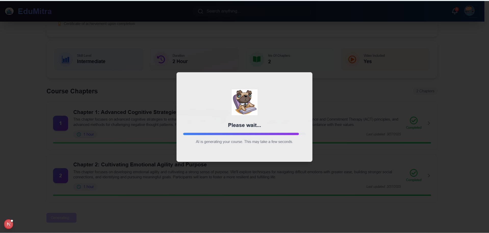
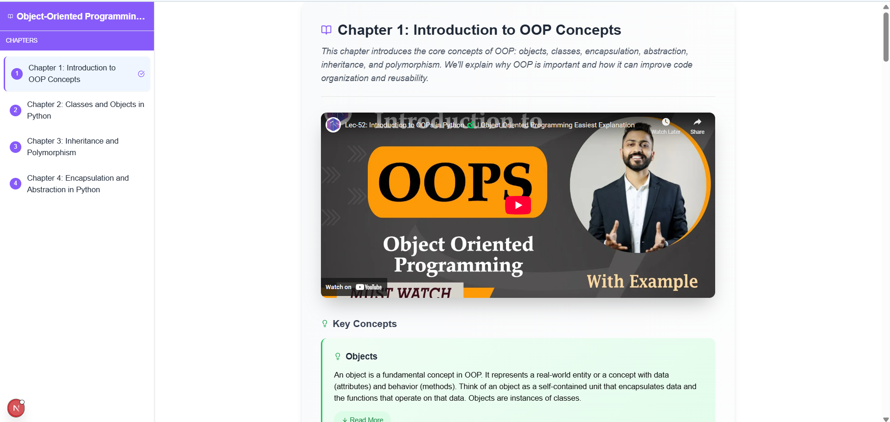
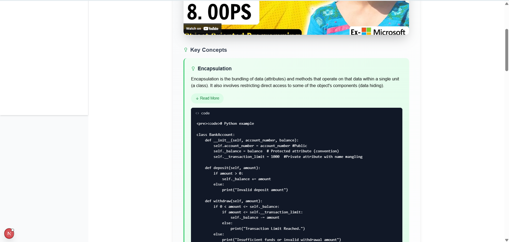

# 🚀 **EduMitra** — AI-Powered Personalized Learning Platform  
> _Your personal AI tutor. Learn faster, smarter, distraction-free._  

---

## 🎯 **The Problem**
Traditional learning platforms are stuck in the past:  
- ❌ One-size-fits-all content  
- ❌ No true personalization  
- ❌ Scattered resources  
- ❌ No pace adaptation  

---

## ✨ **The EduMitra Solution**  
EduMitra transforms your learning with **Google Gemini AI**:  
- 🤖 **Tailored Courses** — Instantly generated to match your needs  
- 🎯 **Custom Learning Paths** — AI-curated for *your* goals  
- 🎥 **Smart Video Integration** — Relevant YouTube videos without distractions  
- 🚀 **All-in-One Platform** — Learn without switching tabs  

---

## 🖼 **Screenshots**  
<p align="center">
  
  
  
  
  
  
  
  
</p>  

---

## 🛠 **Tech Stack**

| **Category**         | **Technologies**                              |
|----------------------|-----------------------------------------------|
| 💻 **Frontend**       | Next.js 14, React, Tailwind CSS               |
| ⚙️ **Backend**        | Next.js App Router, Server-Side Rendering     |
| 🔐 **Auth**           | Clerk                                         |
| 🗄 **Database**       | Neon, Drizzle ORM                             |
| 🤖 **AI Integration** | Google Gemini AI                              |
| 🚀 **Deployment**     | Vercel                                        |

---

## 🌈 **Key Features**
- ⚡ **Instant AI Course Generation**  
- 🧭 **Personalized Learning Paths**  
- 🎥 **Relevant Video Aggregation**  
- 🔒 **Secure Authentication** with Clerk  
- 📊 **Scalable Database Management**  

---

## 🚀 **Getting Started**

### ✅ **Prerequisites**
- Node.js 18+  
- npm / yarn  
- **Google Gemini API Key**  
- **Clerk Account**  
- **Neon Database**  

### ⚙️ **Installation**
```bash
# 1. Clone the repo
git clone (https://github.com/rajshrey7/edumintra).git
cd edumitra

# 2. Install dependencies
npm install

# 3. Create .env file
DATABASE_URL=your_neon_database_url
NEXT_PUBLIC_CLERK_PUBLISHABLE_KEY=your_clerk_key
CLERK_SECRET_KEY=your_clerk_secret_key
GEMINI_API_KEY=your_gemini_api_key

# 4. Run the dev server
npm run dev

